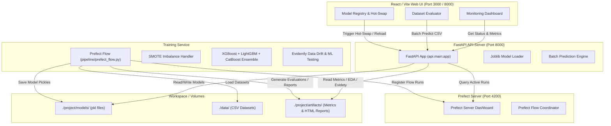

# Credit Card Fraud Detection — Ensemble ML Pipeline & Real-Time Dashboard

[](https://www.python.org/)
[](https://fastapi.tiangolo.com/)
[](https://react.dev/)
[](https://www.prefect.io/)
[](https://scikit-learn.org/)
[](https://xgboost.readthedocs.io/)
[](https://lightgbm.readthedocs.io/)

A production-grade, end-to-end machine learning system designed to detect credit card fraud using advanced tree-based ensemble models, handle heavily imbalanced datasets, orchestrate training pipelines, and display real-time predictions through an interactive React dashboard.

---

## 🏗️ System Architecture

The following diagram illustrates how the frontend, API backend, orchestrator, and model services interact:



---

## ✨ Key Features

1. **Robust Ensemble Modeling**: Trains and evaluates **XGBoost**, **LightGBM**, and **CatBoost** classifiers to achieve state-of-the-art ROC-AUC on imbalanced transaction logs.
2. **SMOTE & Sampling Pipelines**: Employs advanced SMOTE (Synthetic Minority Over-sampling Technique) and random undersampling to balance highly skewed datasets.
3. **MLOps & Pipeline Orchestration**: Uses a **Prefect** workflow manager to schedule, track, and monitor training pipelines.
4. **Data Drift & Quality Monitoring**: Features **Evidently** reports generated automatically post-run to flag feature drift and model performance decay.
5. **Hot-Swappable Model Registry**: Easily promote versioned models to "active" status and hot-reload them directly from the web dashboard.
6. **Analytical ML Engines**: Includes endpoints for time-series forecasting, K-Means cluster profiles, Principal Component Analysis (PCA), and Association Rules mining.

---

## 🚀 Quickstart: Running without Docker

You can run the entire pipeline, database, orchestrator, and dashboard locally using Python and Node.js.

### Prerequisites
- **Python**: `3.11`
- **Node.js**: `20.x` or `24.x`

### 1. Install Backend Dependencies & Setup Python Env
Create a Python virtual environment and install the required machine learning and API libraries:
```bash
# Create the virtual environment
python -m venv .venv

# Activate it (Windows)
.venv\Scripts\activate

# Upgrade pip and install dependencies
pip install --upgrade pip
pip install -r requirements.txt
```

### 2. Launch the Prefect Server
Prefect coordinates the ML pipeline runs. In a separate terminal run:
```bash
.venv\Scripts\prefect server start
```
This runs the Prefect dashboard at [http://localhost:4200](http://localhost:4200).

### 3. Build & Run the React Frontend
In a separate terminal, navigate to the frontend directory, install npm packages, and run the development server:
```bash
cd project/frontend

# Install node dependencies
npm install

# Start Vite dev server
npm run dev
```
The UI dashboard will run at [http://localhost:5173](http://localhost:5173) (or the port shown in your terminal).

### 4. Start the FastAPI API Server
Ensure the Python virtual environment is active, navigate to the `project` directory, and run the Uvicorn server:
```bash
cd project
..\.venv\Scripts\uvicorn api.main:app --host 127.0.0.1 --port 8000
```
The API docs (Swagger) will be accessible at [http://127.0.0.1:8000/docs](http://127.0.0.1:8000/docs).

---

## 🐳 Quickstart: Running with Docker Compose
If you prefer containerized execution, spin up all services instantly:
```bash
docker-compose up --build
```
This launches:
- **FastAPI Unified App** at [http://localhost:8000](http://localhost:8000) (serving both API and compiled React static assets)
- **Prefect Dashboard** at [http://localhost:4200](http://localhost:4200)

---

## 📁 Repository Directory Structure

```text
├── .gitignore             # Comprehensive python, node, and latex gitignore
├── requirements.txt       # Core ML, API, and MLOps packages config
├── data/                  # Raw and processed credit card transaction records
├── project/
│   ├── api/               # FastAPI endpoints, routers, and CORS setup
│   ├── artifacts/         # Evaluation outputs, metrics, and Evidently HTML reports
│   ├── frontend/          # React/Vite dashboard source code
│   ├── models/            # Model registry (.pkl dumps)
│   ├── pipeline/          # Prefect flow and task orchestration
│   ├── src/               # Data processing, feature engineering, and model code
│   └── report.pdf         # Scientific project report on the ML model
└── docs/                  # Project roadmap and domain PDF resources
```
