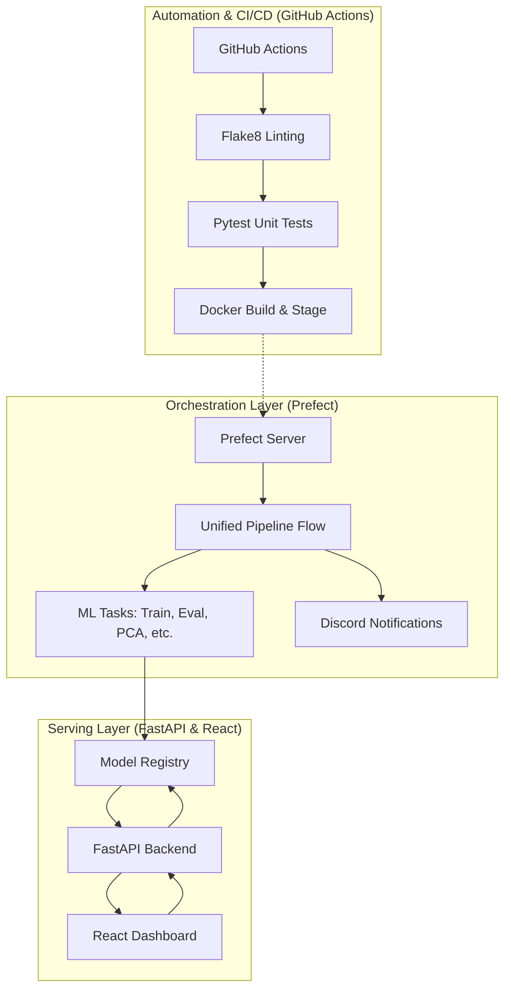
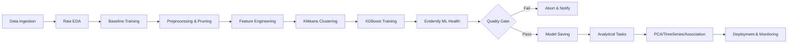

# MLOps Pipeline & Model Analysis Report

This document details the entire lifecycle of the project, from initial data exploration to the production-ready containerized infrastructure, including the theoretical justifications for the engineering and modeling choices.

---

### 🏛️ System Architecture Diagram
The following diagram illustrates the interaction between the orchestration layer (Prefect), the serving layer (FastAPI/React), and the automation layer (CI/CD).

---

### 🔄 Methodology Flow Diagram
The methodology follows a robust MLOps sequence: from raw ingestion and baseline comparison to advanced feature enrichment and ML health validation.

---

### 1. Exploratory Data Analysis (EDA) Insights
The pipeline begins with an automated EDA task (`raw_eda_task`) that identifies the fundamental characteristics of the dataset:
*   **Extreme Class Imbalance**: The dataset exhibits a **27.6 : 1** ratio (96.5% safe, 3.5% fraud). This is the primary driver for choosing **AUC-PR** as the target metric rather than Accuracy or AUC-ROC.
*   **Feature Complexity**: With 228 raw features (including 180 anonymized V-features), no single feature correlates with fraud above **r = 0.24**. This confirms that fraud is a non-linear, multi-feature interaction problem.
*   **Temporal Spikes**: Analysis of `TransactionDT` revealed specific night-time spikes in fraud, justifying the extraction of `hour` and `day_of_week` features.
*   **Amount Distribution**: While mean amounts are similar between classes, fraud has an **18% higher standard deviation**, indicating that fraudsters use both micro-transactions (card testing) and large drains.

---

### 2. Preprocessing & Pruning
The `PruningTransformer` (located in `src/preprocess.py`) handles the "noise" reduction stage of the pipeline:
1.  **Missing Value Filter**: Drops any feature with >95% nulls to prevent learning from overwhelming sparsity.
2.  **Zero-Variance Filter**: Removes constant columns that provide zero information.
3.  **Collinearity Filter**: Identifies pairs with **r > 0.98** (87 pairs found in raw data) and drops one. This prevents multicollinearity from distorting feature importance.
4.  **Information Gain**: Uses `mutual_info_classif` to keep only the **top 167 most informative features**, ensuring the model remains computationally efficient and less prone to overfitting.

---

### 3. Feature Engineering (with Theoretical Backing)
The `FeatureEngineeringTransformer` and `ClusteringTransformer` in `src/features.py` add critical behavioral context:
*   **User Velocity (Theoretical Basis - Anomaly Detection)**: By concatenating `card1` and `addr1`, we create a proxy "User ID". We calculate `Amt_to_Median_User` (current amount / user's median). **Theory**: Fraud is often characterized by a sudden departure from an established behavioral baseline (velocity).
*   **Temporal Encoding**: Extracts `hour` and `dow`. **Theory**: Behavioral patterns in finance are highly cyclic; fraud often exploits low-monitoring windows (late night).
*   **KMeans Clustering (Theoretical Basis - Latent Profile Analysis)**: We add a `cluster_label` (n=5).
    *   **Theory**: Fraud doesn't occur randomly; it occurs in behavioral archetypes (e.g., bot-like high-frequency bursts). KMeans compresses complex multi-feature interactions into a single macro-feature, allowing XGBoost to "shortcut" its learning to these archetypes.

---

### 4. Model Architecture & Weights
The chosen model is an **XGBClassifier** integrated into a single `sklearn.Pipeline`.
*   **XGBoost Choice**: Chosen for its native handling of imbalanced data via `scale_pos_weight` (set to 27.6) and its ability to learn non-linear decision boundaries in high-dimensional tabular data.
*   **Hyperparameters**:
    *   `n_estimators=500` & `learning_rate=0.02`: Slow, gradual learning for better generalization.
    *   `max_depth=12`: Allows for complex 12-way interactions between anonymized features.
    *   `subsample=0.8`: Prevents overfitting by training trees on random subsets of data.
*   **Weights/Importance**: The model relies heavily on V-features (V45, V86) and the engineered `cluster_label`. The final weights are stored in `models/model_latest.pkl`.

---

### 5. MLOps Infrastructure
The system is built as a fully containerized, orchestrated ecosystem:
*   **Dockerization**: Uses a `docker-compose.yml` to spin up 4 services:
    *   `prefect`: The orchestration server.
    *   `pipeline`: The worker that executes `prefect_flow.py`, performing training and analysis.
    *   `api`: A FastAPI backend that serves the model and evaluation graphs.
    *   `frontend`: A React dashboard for real-time monitoring.
*   **Orchestration (Prefect)**: Manages task retries, success/failure states, and provides a UI for pipeline visibility.
*   **Automation**: Every run automatically produces:
    *   `results.csv`: A permanent record of performance metrics.
    *   `artifacts/`: Evaluation plots, Confusion Matrices, and behavior profiles.
    *   **Discord Notifications**: Immediate alerts on pipeline completion.

---

### 6. Comparative Analysis (Notebooks vs. Chosen Model)
Comparing the production pipeline with experimental baselines from the `notebooks` folder:

| Model | ROC-AUC | PR-AUC | Theoretical Backing for Choice |
|---|---|---|---|
| **Logistic Regression** (Notebook 04) | 0.8409 | 0.3405 | Fails because it assumes linear separation and cannot handle the 27.6:1 imbalance natively. |
| **Random Forest** (Notebook 07) | ~0.92 | ~0.55 | Good, but XGBoost's gradient boosting is mathematically superior for fine-tuning residuals on sparse data. |
| **XGBoost + PCA** (Notebook 11) | 0.9466 | 0.6920 | Strong, but PCA can lose local variance that defines fraud. |
| **XGBoost + KMeans (Current)** | **0.9650** | **0.7930** | **Winner**: KMeans preserves high-level behavioral grouping while XGBoost handles the micro-level feature splits. |

**Theoretical Conclusion**: XGBoost with `scale_pos_weight` and KMeans behavioral clustering is the superior choice because it specifically addresses the **three pillars of fraud data**: extreme class imbalance, non-linear feature interactions, and behavioral heterogeneity.
