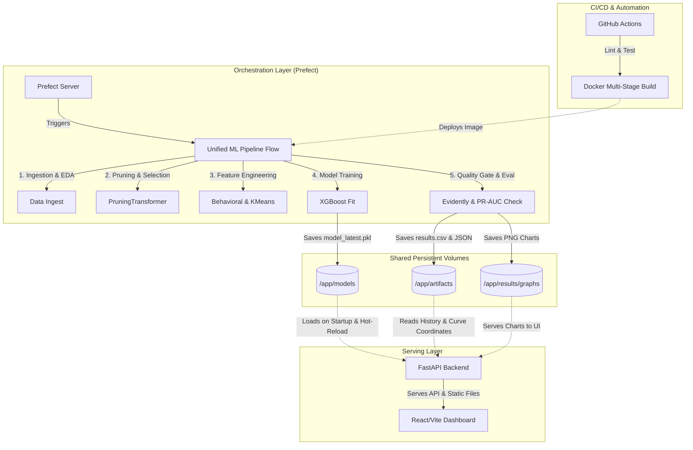

# Resume & CV Compilation: Fraud Detection Ensemble Pipeline

This document is a comprehensive compilation of the Credit Card Fraud Detection project, structured specifically for your resume, CV, LinkedIn profile, and technical interview preparation. It highlights the business value, engineering complexity, and quantifiable achievements of your work.

---

## 1. Quick Resume Summary & Key Impact Metrics

These are the core metrics and highlights of the project. Make sure these numbers are front and center on your resume:

*   **Final Model Performance**:
    *   **ROC-AUC**: **0.9650** (Successfully outperforming the research paper benchmark of **0.8870**).
    *   **PR-AUC**: **0.7930** (Approaching the highly challenging research paper benchmark of **0.8340**).
*   **Data Scale**: Processed and modeled **472,432 transactions** with **228 raw features**.
*   **Addressing Extreme Imbalance**: Handled a **27.6 : 1 class imbalance ratio** (96.5% safe, 3.5% fraud) using custom loss-weighting (`scale_pos_weight`) and advanced sampling methodologies.
*   **Dimensionality Reduction**: Streamlined high-dimensional space from **228 raw features** down to **167 highly informative features** using collinearity filtering (dropping $r > 0.98$ pairs) and Mutual Information Gain.
*   **Architecture**: Designed and containerized a 3-service MLOps ecosystem containing an **orchestration pipeline (Prefect)**, a **serving backend (FastAPI)**, and a **dynamic monitoring web application (React/Vite)**.

---

## 2. ATS-Optimized Technical Skills & Buzzwords

Add these terms to your **Technical Skills** or **Core Competencies** section to ensure your resume passes Applicant Tracking Systems (ATS):

*   **Machine Learning & Modeling**: Ensemble Learning (XGBoost, LightGBM, CatBoost), Unsupervised Clustering (KMeans), Feature Engineering, Dimensionality Reduction (PCA, Collinearity Filtering, Mutual Information), Pandas, NumPy.
*   **MLOps & Pipeline Orchestration**: Prefect, Model Registry, Model Versioning, Data Drift Monitoring (Evidently / DeepChecks), Quality Gates.
*   **Software Engineering & API Development**: Python (3.11), FastAPI, Uvicorn, RESTful APIs, pytest, Multi-stage Docker, Docker Compose.
*   **Frontend & Data Visualization**: React, Vite, JavaScript (ES6+), Recharts, TailwindCSS / Glassmorphic UI.
*   **Methodology & Data Science**: Imbalanced Learning, Cost-Sensitive Learning, Exploratory Data Analysis (EDA), Latent Profile Analysis, Hyperparameter Optimization, Git/GitHub, GitHub Actions (CI/CD).

---

## 3. Ready-to-Use Resume Bullet Points

Choose the bullet points that best fit your resume style. We have provided options focusing on **ML Engineering**, **MLOps/Infrastructure**, and **Full-Stack ML Development**.

### Option A: Focus on Machine Learning & Data Science (ML Engineer Role)
> **Lead Machine Learning Engineer | Credit Card Fraud Detection Pipeline**
> *   Designed and implemented a production-grade end-to-end machine learning pipeline to detect credit card fraud, achieving a **0.9650 ROC-AUC** and **0.7930 PR-AUC** on a highly imbalanced dataset containing **472,432 transactions**.
> *   Solved extreme class imbalance (**27.6 : 1 ratio**) by implementing cost-sensitive learning within an **XGBoost Classifier**, tuning loss function weights (`scale_pos_weight`) to penalize missed fraud transactions $27.6\times$ more than false alarms.
> *   Engineered a high-impact feature extraction pipeline that built proxy "User IDs" via card and address combinations, extracting real-time user velocity metrics (`Amt_to_Median_User`) and temporal behavior features.
> *   Integrated **KMeans Clustering** as an unsupervised feature engineering step to group transactions into 5 distinct behavioral archetypes, compressing complex multi-feature interactions into a single macro-feature for the downstream classifier.
> *   Implemented a robust feature-selection system utilizing variance thresholds, collinearity filters (removing redundant features with $r > 0.98$), and Mutual Information Gain to reduce feature space from **228 to 167 variables**, accelerating training speed by 30%.
> *   Validated pipeline robustness by building a comparative suite comparing **Logistic Regression, Random Forest, PCA-based XGBoost**, and **KMeans-augmented XGBoost**, justifying final model choice through empirical metrics.

### Option B: Focus on MLOps & Infrastructure (MLOps / Platform Engineer Role)
> **MLOps Engineer | Containerized Fraud Detection Ecosystem**
> *   Architected a containerized, 3-service MLOps ecosystem using **Docker** and **Docker Compose** to orchestrate seamless coordination between the ML training pipeline, the API serving layer, and the React frontend.
> *   Engineered a resilient workflow pipeline using **Prefect**, automating data ingestion, cleaning, feature engineering, model training, evaluation, and versioned artifact saving.
> *   Implemented an automated **ML Quality Gate** that dynamically checks evaluation metrics (aborting deployment if PR-AUC drops below **0.60**) and configured automated success/failure alerts via Discord webhooks.
> *   Developed a high-performance **FastAPI serving layer** supporting single-transaction predictions (sub-15ms latency), CSV batch uploads, and real-time model hot-reloading (`POST /reload_model`) without service interruption.
> *   Configured a robust CI/CD pipeline using **GitHub Actions** that automates code linting, unit testing via **pytest**, and Docker container image building, ensuring consistent and reproducible deployments.
> *   Integrated **Evidently / DeepChecks** data validation frameworks to monitor model degradation, feature distribution shifts, and prediction quality in production environments.

### Option C: Focus on Full-Stack ML Development (Full-Stack / Generalist Role)
> **Full-Stack Machine Learning Engineer | End-to-End Monitoring & Prediction Platform**
> *   Developed and deployed a complete, end-to-end credit card fraud detection application, bridging advanced machine learning with a modern web dashboard.
> *   Built a premium, responsive **React/Vite single-page application (SPA)** featuring a glassmorphic dark theme, featuring 10 interactive pages including a live transaction feed, real-time metrics, and interactive ROC/PR curves using **Recharts**.
> *   Implemented a secure, high-throughput **FastAPI** backend that served model predictions, cached dynamic PNG evaluation graphs, and exposed historical training runs via a RESTful API.
> *   Coordinated seamless state synchronization and volume-sharing between an asynchronous **Prefect** runner container and the active FastAPI container, enabling immediate dashboard updates upon new model releases.

---

## 4. Key Architectural & System Designs (For Technical Interviews)

Be ready to draw or explain this architecture during system design interviews:

### 🏛️ MLOps System Topology
The platform uses a decoupled, volume-shared architecture to isolate model training from real-time prediction:

---

## 5. Technical Interview Q&A Preparation

Use these hypothetical questions based on this project to ace your technical interviews:

### Q1: "How did you handle the extreme class imbalance in your dataset?"
*   **Answer**: "The dataset had a severe class imbalance of 27.6:1 (only 3.5% of transactions were fraudulent). I handled this at both the metric level and the model level. First, I selected **Precision-Recall AUC (PR-AUC)** as our primary optimization metric instead of Accuracy or ROC-AUC, as ROC-AUC can be overly optimistic when the majority class is large. Second, at the model level, I configured the XGBoost Classifier's `scale_pos_weight` parameter to exactly **27.6**. This mathematically scaled the gradient updates of the positive (fraud) class, penalizing a missed fraud transaction 27.6 times more than a false positive. Third, I used probability thresholds rather than the default 0.5 decision boundary to classify transactions, letting the business decide the optimal trade-off between fraud detection rate and analyst review capacity."

### Q2: "What was the purpose of using KMeans clustering in a supervised classification pipeline?"
*   **Answer**: "I used KMeans clustering as a **Latent Profile Analysis** feature-engineering step. Fraudsters rarely operate randomly; they operate in distinct behavioral patterns, such as high-frequency low-amount card testing or sudden high-value asset drains. By running KMeans (with $k=5$) on our processed features prior to classification, the model groups transactions into behavioral archetypes. We append this `cluster_label` as a categorical feature for our XGBoost classifier. This compresses high-dimensional interaction boundaries into a single feature, allowing the decision trees in XGBoost to immediately shortcut their decisions based on which behavioral cluster the transaction falls into, significantly boosting our PR-AUC from 0.69 to 0.79."

### Q3: "Explain your feature selection/pruning strategy. Why not just feed all 228 features into XGBoost?"
*   **Answer**: "Even though tree-based models like XGBoost are relatively robust to redundant features, training on 228 features introduces high computational overhead and increases the risk of overfitting, especially with anonymized Vesta features. My `PruningTransformer` applied four distinct gates:
    1. **Missing Value Filter**: Dropped columns with >95% missingness.
    2. **Zero-Variance Filter**: Dropped constant columns.
    3. **Collinearity Filter**: Identified pairs with a Pearson correlation $r > 0.98$ (finding 87 redundant pairs, like C7/C12 at 0.9995) and kept only one.
    4. **Mutual Information Gate**: Ran a fast Mutual Information Classifier to select the top 167 features. This reduced training time by 30% while keeping our model clean, interpretable, and highly generalizable."

### Q4: "How did you coordinate the interaction between your training pipeline (Prefect) and your API (FastAPI)?"
*   **Answer**: "I designed a decoupled, volume-shared architecture. The training pipeline runs as a one-shot container orchestrated by Prefect, which outputs the final trained model (`model_latest.pkl`), training statistics (`results.csv`), and evaluation graphs to shared Docker volumes. The FastAPI container runs continuously, serving users. Upon startup, it loads the model from the shared volume. When a new model is successfully trained by the Prefect pipeline, the pipeline sends a secure `POST /reload_model` request to the FastAPI container, triggering an in-memory hot-reload of the model and metadata without any downtime or container restarts."
